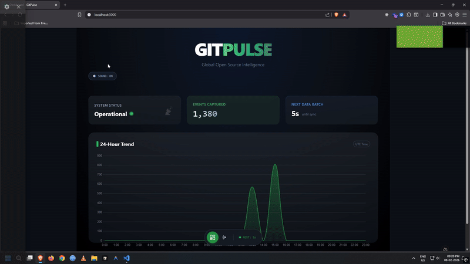
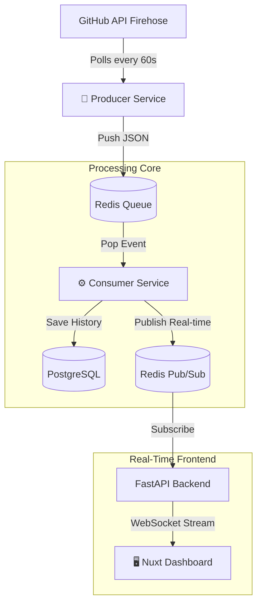
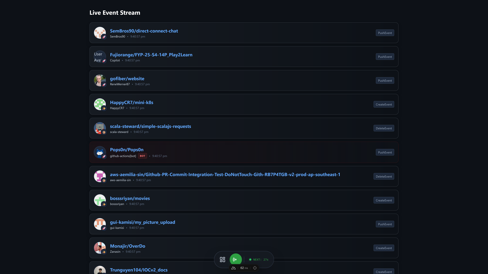
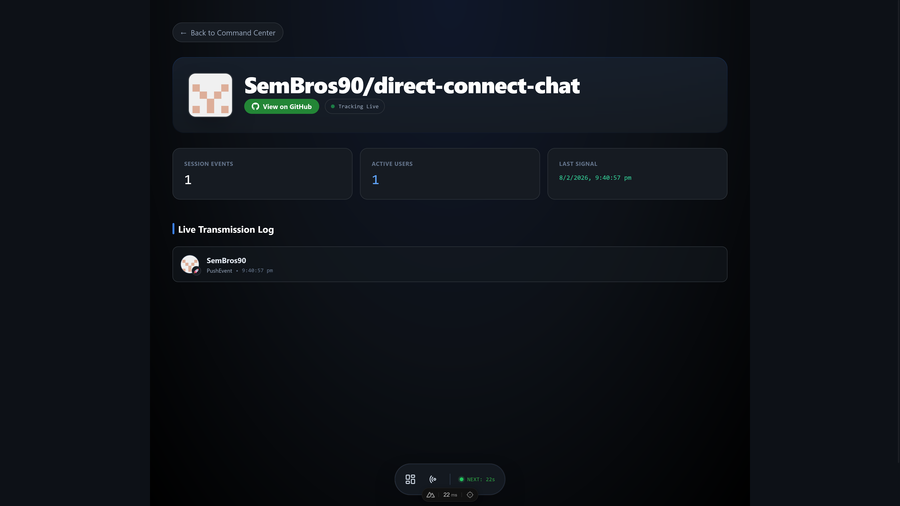

# GitPulse: Real-Time Global Developer Activity


> **"The Heartbeat of Open Source"**

**GitPulse** is a real-time full-stack intelligence platform that visualizes the global pulse of software development. It ingests live events from the GitHub Firehose, processes them through a high-throughput streaming pipeline, and broadcasts them to a cyber-glass dashboard with sub-second latency.



---

## Architecture

The system uses a **Producer-Consumer** pattern with **Redis** serving as both a message broker (Queue) and a real-time broadcaster (Pub/Sub).



---

## Project Structure

```bash
gitpulse/
├── backend/              # FastAPI Service (WebSocket & Stats API)
│   ├── database/         # Database connection & init
│   ├── models/           # SQLModel definitions
│   ├── main.py           # API Entry point
│   └── Dockerfile
├── consumer/             # Background Worker (Redis -> DB)
│   ├── main.py
│   └── Dockerfile
├── producer/             # Data Ingestor (GitHub -> Redis)
│   ├── main.py
│   └── Dockerfile
├── frontend/             # Nuxt 4 Client
│   ├── app/              # Nuxt App Directory
│   │   ├── components/   # UI Components (Charts, Cards)
│   │   ├── composables/  # Logic (useEventStream, WebSocket)
│   │   ├── layouts/      # Base Layouts
│   │   ├── pages/        # Routes (Dashboard, Repo Details)
│   │   └── app.vue       # Root Component
│   ├── public/           # Static assets
│   ├── nuxt.config.ts    # Nuxt Configuration
│   ├── tailwind.config.js
│   └── Dockerfile
├── docs/                 # Documentation & screenshots
├── docker-compose.yml    # Orchestration for all services
└── .env.example          # Environment template
```

---

## Features

- **🔥 Real-Time Ingestion:** Consumes live data from GitHub's `/events` API
- **⚡ WebSocket Streaming:** Instant updates using Redis Pub/Sub broadcasting
- **📊 Live Visualization:**
  - **24-Hour Rhythm:** Area line charts with gradient fills using Chart.js
  - **Animated Counters:** Floating indicators for instant feedback
  - **Audio Cues:** Subtle sound effects on data arrival
- **🤖 Bot Detection:** Automatically flags automated actors (Dependabot, Renovate)
- **💎 Cyber Aesthetic:** Glassmorphism UI, neon accents, and dark mode
- **🐳 Dockerized:** One-command deployment for the entire stack

---

## Tech Stack

- **Frontend:** Nuxt 3, Vue.js, TailwindCSS, Chart.js
- **Backend:** Python 3.11, FastAPI, Uvicorn
- **Database:** PostgreSQL (History), Redis (Queue & Pub/Sub)
- **Runtime:** Bun (Frontend), Python (Backend)
- **DevOps:** Docker, Docker Compose

---

## Getting Started

### Prerequisites

- Docker & Docker Compose installed
- A GitHub Account (for the Personal Access Token)

### 1. Clone the Repository

```bash
git clone https://github.com/Shahid0324-GIT/gitpulse.git
cd gitpulse
```

### 2. Configure Environment

Copy the example environment file and add your credentials:

```bash
cp .env.example .env
```

Edit `.env` with your configuration:

```ini
# .env
GITHUB_TOKEN=your_github_pat_token_here
REDIS_HOST=redis
POSTGRES_USER=postgres
POSTGRES_PASSWORD=password
POSTGRES_DB=gitpulse
DATABASE_URL=postgresql://postgres:password@db:5432/gitpulse
```

> **Note:** To get a GitHub Token, go to **Settings → Developer Settings → Personal Access Tokens (Classic)**. No specific scopes are needed for public data.

### 3. Launch the System

```bash
docker compose up --build
```

### 4. Access the Dashboard

- **Frontend:** <http://localhost:3000>
- **Backend API:** <http://localhost:8000/docs>

---

## Screenshots

| **Live Dashboard**                            | **Feed Page**                       | **Repository Detail**                        |
| --------------------------------------------- | ----------------------------------- | -------------------------------------------- |
|  |  |  |
| _Real-time metrics & graphs_                  | _Real-time feed updates_            | _Deep dive into specific repos_              |

---

## Contributing

Pull requests are welcome! For major changes, please open an issue first to discuss what you would like to change.

---

## License

[MIT](https://choosealicense.com/licenses/mit/)
